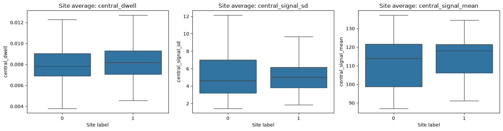
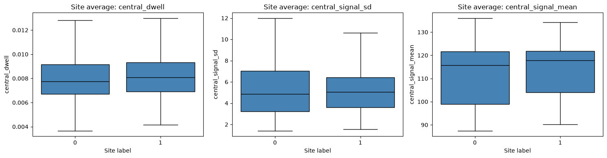
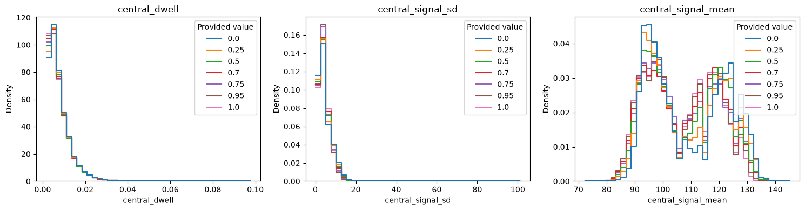

# Dataset overview: data0, data1 and data2


## Dataset Summary

| | data0 | data1 | data2 |
|---|---:|---:|---:|
| Read observations | 11,027,106 | 7,907,952 | 1,171,940 |
| Sites | 121,838 | 90,810 | 1,323 |
| Transcripts | 5,333 | 4,451 | 7 |
| Genes with available IDs | 3,852 | no gene_id column | no gene_id column |
| Labels | Binary: 0 / 1 | Binary: 0 / 1 | Seven values between 0 and 1<br>(0, 0.25, 0.50, 0.70, 0.75, 0.95, 1.00) |
| Positive sites (label 1) | 5,475 (4.49%) | 6,593 (7.26%) | Binary interpretation not established |
| Median reads per site | 47 | 40 | 814 |
| Read coverage range | 20–991 | 20–994 | 26–3,438 |


## What each row represents

Each row is a **read observation at a transcript-position site**. Multiple reads belong to the same site, and the site's sequence, coverage and annotation repeat across those rows. A site is identified by `transcript_id` and `transcript_position` within a dataset.

| Fields | Description |
|---|---|
| `transcript_id`, `transcript_position` | Identify the site |
| `sequence`, `central_5mer` | Local 7-base sequence and its central 5-base motif |
| `n_reads`, `read_idx` | Site coverage and an index for each read within the site |
| Nine signal measurements | Dwell, signal mean and signal standard deviation at three offsets: minus1, central and plus1 |
| `gene_id` | Gene annotation, available only in data0 |
| `label` | Site annotation; binary in data0/data1, decimal-valued in data2 |

- Labels describe sites, not independently labelled reads.
- Site counts represent transcript positions, not necessarily unique genomic locations.
- The datasets may contain overlapping sites, so their site counts should not be treated as counts of distinct biological sites across all three datasets.


### Preview of the dataset parquet files


```python
from pathlib import Path
import pyarrow.parquet as pq

ROOT = Path.cwd()

# If the notebook starts inside notebooks/, move to the repo root.
if not (ROOT / "data/processed").is_dir():
    ROOT = ROOT.parent

if not (ROOT / "data/processed").is_dir():
    raise FileNotFoundError(
        "Cannot find data/processed. Set ROOT to your repository path."
    )

for dataset in ["data0", "data1", "data2"]:
    path = ROOT / f"data/processed/{dataset}_reads.parquet"

    parquet_file = pq.ParquetFile(path)
    batch = next(parquet_file.iter_batches(batch_size=5), None)

    print(f"\n{dataset}")
    if batch is None:
        print("The file is empty.")
    else:
        display(batch.to_pandas())
```

    
    data0


<div>
<style scoped>
    .dataframe tbody tr th:only-of-type {
        vertical-align: middle;
    }

    .dataframe tbody tr th {
        vertical-align: top;
    }

    .dataframe thead th {
        text-align: right;
    }
</style>
<table border="1" class="dataframe">
  <thead>
    <tr style="text-align: right;">
      <th></th>
      <th>transcript_id</th>
      <th>transcript_position</th>
      <th>sequence</th>
      <th>central_5mer</th>
      <th>n_reads</th>
      <th>read_idx</th>
      <th>minus1_dwell</th>
      <th>minus1_signal_sd</th>
      <th>minus1_signal_mean</th>
      <th>central_dwell</th>
      <th>central_signal_sd</th>
      <th>central_signal_mean</th>
      <th>plus1_dwell</th>
      <th>plus1_signal_sd</th>
      <th>plus1_signal_mean</th>
      <th>gene_id</th>
      <th>label</th>
    </tr>
  </thead>
  <tbody>
    <tr>
      <th>0</th>
      <td>ENST00000000233</td>
      <td>244</td>
      <td>AAGACCA</td>
      <td>AGACC</td>
      <td>185</td>
      <td>0</td>
      <td>0.00299</td>
      <td>2.06</td>
      <td>125.0</td>
      <td>0.01770</td>
      <td>10.40</td>
      <td>122.0</td>
      <td>0.00930</td>
      <td>10.90</td>
      <td>84.1</td>
      <td>ENSG00000004059</td>
      <td>0.0</td>
    </tr>
    <tr>
      <th>1</th>
      <td>ENST00000000233</td>
      <td>244</td>
      <td>AAGACCA</td>
      <td>AGACC</td>
      <td>185</td>
      <td>1</td>
      <td>0.00631</td>
      <td>2.53</td>
      <td>125.0</td>
      <td>0.00844</td>
      <td>4.67</td>
      <td>126.0</td>
      <td>0.01030</td>
      <td>6.30</td>
      <td>80.9</td>
      <td>ENSG00000004059</td>
      <td>0.0</td>
    </tr>
    <tr>
      <th>2</th>
      <td>ENST00000000233</td>
      <td>244</td>
      <td>AAGACCA</td>
      <td>AGACC</td>
      <td>185</td>
      <td>2</td>
      <td>0.00465</td>
      <td>3.92</td>
      <td>109.0</td>
      <td>0.01360</td>
      <td>12.00</td>
      <td>124.0</td>
      <td>0.00498</td>
      <td>2.13</td>
      <td>79.6</td>
      <td>ENSG00000004059</td>
      <td>0.0</td>
    </tr>
    <tr>
      <th>3</th>
      <td>ENST00000000233</td>
      <td>244</td>
      <td>AAGACCA</td>
      <td>AGACC</td>
      <td>185</td>
      <td>3</td>
      <td>0.00398</td>
      <td>2.06</td>
      <td>125.0</td>
      <td>0.00830</td>
      <td>5.01</td>
      <td>130.0</td>
      <td>0.00498</td>
      <td>3.78</td>
      <td>80.4</td>
      <td>ENSG00000004059</td>
      <td>0.0</td>
    </tr>
    <tr>
      <th>4</th>
      <td>ENST00000000233</td>
      <td>244</td>
      <td>AAGACCA</td>
      <td>AGACC</td>
      <td>185</td>
      <td>4</td>
      <td>0.00664</td>
      <td>2.92</td>
      <td>120.0</td>
      <td>0.00266</td>
      <td>3.94</td>
      <td>129.0</td>
      <td>0.01300</td>
      <td>7.15</td>
      <td>82.2</td>
      <td>ENSG00000004059</td>
      <td>0.0</td>
    </tr>
  </tbody>
</table>
</div>


    
    data1


<div>
<style scoped>
    .dataframe tbody tr th:only-of-type {
        vertical-align: middle;
    }

    .dataframe tbody tr th {
        vertical-align: top;
    }

    .dataframe thead th {
        text-align: right;
    }
</style>
<table border="1" class="dataframe">
  <thead>
    <tr style="text-align: right;">
      <th></th>
      <th>transcript_id</th>
      <th>transcript_position</th>
      <th>sequence</th>
      <th>central_5mer</th>
      <th>n_reads</th>
      <th>read_idx</th>
      <th>minus1_dwell</th>
      <th>minus1_signal_sd</th>
      <th>minus1_signal_mean</th>
      <th>central_dwell</th>
      <th>central_signal_sd</th>
      <th>central_signal_mean</th>
      <th>plus1_dwell</th>
      <th>plus1_signal_sd</th>
      <th>plus1_signal_mean</th>
      <th>gene_id</th>
      <th>label</th>
    </tr>
  </thead>
  <tbody>
    <tr>
      <th>0</th>
      <td>ENST00000000233</td>
      <td>244</td>
      <td>AAGACCA</td>
      <td>AGACC</td>
      <td>165</td>
      <td>0</td>
      <td>0.00465</td>
      <td>2.16</td>
      <td>127.0</td>
      <td>0.00640</td>
      <td>3.90</td>
      <td>127.0</td>
      <td>0.00797</td>
      <td>8.75</td>
      <td>83.7</td>
      <td>NaN</td>
      <td>0.0</td>
    </tr>
    <tr>
      <th>1</th>
      <td>ENST00000000233</td>
      <td>244</td>
      <td>AAGACCA</td>
      <td>AGACC</td>
      <td>165</td>
      <td>1</td>
      <td>0.02690</td>
      <td>4.43</td>
      <td>106.0</td>
      <td>0.01860</td>
      <td>10.00</td>
      <td>123.0</td>
      <td>0.00863</td>
      <td>6.20</td>
      <td>80.0</td>
      <td>NaN</td>
      <td>0.0</td>
    </tr>
    <tr>
      <th>2</th>
      <td>ENST00000000233</td>
      <td>244</td>
      <td>AAGACCA</td>
      <td>AGACC</td>
      <td>165</td>
      <td>2</td>
      <td>0.00432</td>
      <td>3.10</td>
      <td>108.0</td>
      <td>0.01200</td>
      <td>8.26</td>
      <td>125.0</td>
      <td>0.01590</td>
      <td>2.89</td>
      <td>78.7</td>
      <td>NaN</td>
      <td>0.0</td>
    </tr>
    <tr>
      <th>3</th>
      <td>ENST00000000233</td>
      <td>244</td>
      <td>AAGACCA</td>
      <td>AGACC</td>
      <td>165</td>
      <td>3</td>
      <td>0.00996</td>
      <td>4.52</td>
      <td>123.0</td>
      <td>0.01750</td>
      <td>8.51</td>
      <td>128.0</td>
      <td>0.00498</td>
      <td>2.63</td>
      <td>80.0</td>
      <td>NaN</td>
      <td>0.0</td>
    </tr>
    <tr>
      <th>4</th>
      <td>ENST00000000233</td>
      <td>244</td>
      <td>AAGACCA</td>
      <td>AGACC</td>
      <td>165</td>
      <td>4</td>
      <td>0.00764</td>
      <td>2.81</td>
      <td>124.0</td>
      <td>0.00772</td>
      <td>4.22</td>
      <td>126.0</td>
      <td>0.00474</td>
      <td>5.84</td>
      <td>80.9</td>
      <td>NaN</td>
      <td>0.0</td>
    </tr>
  </tbody>
</table>
</div>


    
    data2


<div>
<style scoped>
    .dataframe tbody tr th:only-of-type {
        vertical-align: middle;
    }

    .dataframe tbody tr th {
        vertical-align: top;
    }

    .dataframe thead th {
        text-align: right;
    }
</style>
<table border="1" class="dataframe">
  <thead>
    <tr style="text-align: right;">
      <th></th>
      <th>transcript_id</th>
      <th>transcript_position</th>
      <th>sequence</th>
      <th>central_5mer</th>
      <th>n_reads</th>
      <th>read_idx</th>
      <th>minus1_dwell</th>
      <th>minus1_signal_sd</th>
      <th>minus1_signal_mean</th>
      <th>central_dwell</th>
      <th>central_signal_sd</th>
      <th>central_signal_mean</th>
      <th>plus1_dwell</th>
      <th>plus1_signal_sd</th>
      <th>plus1_signal_mean</th>
      <th>gene_id</th>
      <th>label</th>
    </tr>
  </thead>
  <tbody>
    <tr>
      <th>0</th>
      <td>tx_id_0</td>
      <td>0</td>
      <td>AAAACCT</td>
      <td>AAACC</td>
      <td>885</td>
      <td>0</td>
      <td>0.01220</td>
      <td>3.99</td>
      <td>106.0</td>
      <td>0.00337</td>
      <td>4.56</td>
      <td>102.0</td>
      <td>0.00664</td>
      <td>4.20</td>
      <td>84.2</td>
      <td>NaN</td>
      <td>1.0</td>
    </tr>
    <tr>
      <th>1</th>
      <td>tx_id_0</td>
      <td>0</td>
      <td>AAAACCT</td>
      <td>AAACC</td>
      <td>885</td>
      <td>1</td>
      <td>0.03020</td>
      <td>2.32</td>
      <td>107.0</td>
      <td>0.00443</td>
      <td>2.36</td>
      <td>102.0</td>
      <td>0.00332</td>
      <td>2.13</td>
      <td>79.2</td>
      <td>NaN</td>
      <td>1.0</td>
    </tr>
    <tr>
      <th>2</th>
      <td>tx_id_0</td>
      <td>0</td>
      <td>AAAACCT</td>
      <td>AAACC</td>
      <td>885</td>
      <td>2</td>
      <td>0.00232</td>
      <td>5.55</td>
      <td>110.0</td>
      <td>0.00664</td>
      <td>7.04</td>
      <td>99.3</td>
      <td>0.00232</td>
      <td>2.21</td>
      <td>86.6</td>
      <td>NaN</td>
      <td>1.0</td>
    </tr>
    <tr>
      <th>3</th>
      <td>tx_id_0</td>
      <td>0</td>
      <td>AAAACCT</td>
      <td>AAACC</td>
      <td>885</td>
      <td>3</td>
      <td>0.00465</td>
      <td>2.10</td>
      <td>104.0</td>
      <td>0.00996</td>
      <td>3.90</td>
      <td>108.0</td>
      <td>0.00401</td>
      <td>2.18</td>
      <td>82.2</td>
      <td>NaN</td>
      <td>1.0</td>
    </tr>
    <tr>
      <th>4</th>
      <td>tx_id_0</td>
      <td>0</td>
      <td>AAAACCT</td>
      <td>AAACC</td>
      <td>885</td>
      <td>4</td>
      <td>0.02110</td>
      <td>3.49</td>
      <td>103.0</td>
      <td>0.00531</td>
      <td>3.80</td>
      <td>101.0</td>
      <td>0.00997</td>
      <td>2.18</td>
      <td>81.2</td>
      <td>NaN</td>
      <td>1.0</td>
    </tr>
  </tbody>
</table>
</div>


## Main findings

### data0 and data1

- **Both are highly imbalanced binary datasets.**
    - Labels are described as 0 = unmodified and 1 = modified.
    - Positives account for 4.49% of data0 and 7.26% of data1.
- **Sequence context is associated with labels.** 
    - GGACT has the highest positive fraction in both datasets: 22.58% in data0 and 21.90% in data1.
    - Other motifs have much lower positive fractions, so sequence should be considered alongside signal measurements.
- **Coverage varies widely.** 
    - Most sites have far fewer reads than the maximum. 
    - In data0, median coverage is similar between classes (47 vs 48). 

        | label | count	| mean | std | min | 25% | 50% | 75% | max |
        | -- | -- | -- | -- | -- | -- | -- | -- | -- |					
        | 0 | 116363.0 | 90.471473 | 137.518566 | 20.0 | 32.0 | 47.0 | 84.0 | 991.0 |
        | 1 | 5475.0 | 91.246393 |	133.346687 | 20.0 | 32.0 | 48.0 | 87.0 | 966.0 |

    - In data1, positives have higher median coverage (39 vs 47).
    
        | label | count	| mean | std | min | 25% | 50% | 75% | max |
        | -- | -- | -- | -- | -- | -- | -- | -- | -- |						
        | 0 | 84217.0 | 85.550233 | 144.146207 | 20.0 | 27.0 | 39.0 | 75.0 | 993.0 |
        | 1 | 6593.0 | 106.653724 |	167.426167 | 20.0 | 29.0 | 47.0 | 96.0 | 994.0 |

- **Signal distributions overlap.** 
    - In data0 and data1, positive sites have slightly higher median values for the three central signal summaries, but none clearly separates the classes alone.
        - data0
        
        - data1
        

### data2

- **Has a different annotation structure.** 
    - Values are 0, 0.25, 0.50, 0.70, 0.75, 0.95 and 1.00, with 189 sites per value. 
    - Their meaning is unconfirmed; need to clarify with prof if they should not be treated as binary labels or modification probabilities.
- **Each of the seven transcripts has 189 sites and one constant annotation value.** 
    - Transcript identity and annotation value are therefore linked, making their effects difficult to distinguish.
- **Coverage is much higher:** 
    - median: 814 reads per site 
    - much higher compared to 40–47 in data0 and data1.
- **Central motif composition is equal across annotation groups.**
    - Central signal distributions still overlap substantially; observed differences cannot be separated from transcript effects.
    


## Data quality and interpretation

- No missing values were reported in the signal, sequence, coverage or label fields. Gene IDs are entirely missing in data1 and data2.
- Site metadata and stored read counts were consistent, and no duplicate site–read keys were detected.
- All central motifs match the expected DRACH pattern, and every site has at least 20 reads.
- data2's existing binary motif summary excludes intermediate annotations. Its reported 50% positive fractions should not be used to describe data2.


## Next Steps

1. **Start with one feature row per site.** Summarise all nine signals across reads using measures such as mean, median, standard deviation and quartiles.
2. **Include sequence context.** Compare sequence-only, signal-only and combined features to establish what the signals add.
3. **Retain coverage for quality checks.** Test whether including it as a predictor helps consistently, because coverage differs across datasets and classes.
4. **Keep identifiers and annotations out of predictors.** Keep related sites together when splitting data, and check overlap between datasets to prevent leakage.
5. **Keep data2 separate from binary modelling** until its annotation meaning and experimental design are clarified.

